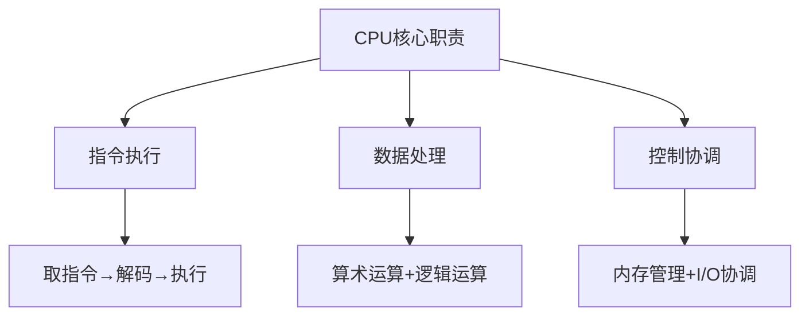

## CPU 工作原理

### 1. CPU 的基本组成

#### 1.1 CPU 的本质与职责

CPU 作为计算机的核心处理单元，主要履行以下三方面职责：

- **指令执行**：逐条解析并运行程序指令，确保程序按序执行
- **数据处理**：执行算术运算（加减乘除）与逻辑运算（与、或、非），对数据进行加工
- **控制协调**：管理内存读写操作，协调 I/O 设备与其他组件交互，保障各部件协同运作



简而言之，CPU 可看作依据内存中的指令进行计算，并将计算结果写回内存、硬盘或其他外部设备的组件。

#### 1.2 CPU 的组成结构

**设计原则：** 基于"分工合作"思想，将复杂的计算任务分解为专门的功能单元。

**1. 控制单元（Control Unit, CU）** 控制单元是 CPU 的"指挥中心"，包含以下关键组件：

- **程序计数器（PC）**：存储下一条待执行指令的地址
- **指令寄存器（IR）**：暂存当前执行的指令
- **指令译码器**：分析解码指令，确定操作类型
- **操作控制器（OC）**：由节拍脉冲发生器、控制矩阵、时钟脉冲发生器等组成

**2. 算术逻辑单元（Arithmetic Logic Unit, ALU）**

- ALU 是 CPU 数据运算的核心
- 执行加减乘除等算术运算
- 执行与或非等逻辑运算
- 现代 ALU 还支持位移、旋转等操作

**3. 存储单元**

```
存储层次（速度从快到慢）：
寄存器 > L1缓存 > L2缓存 > L3缓存 > 主内存
```

- **寄存器（Registers）**：CPU 内部高速存储单元，访问速度最快
- **缓存（Cache）**：L1/L2/L3 多级缓存，缓解 CPU 与内存速度差异
- **缓冲区**：临时存储数据和指令

**4. 总线接口**

- **内部总线**：连接 CPU 内部各功能单元
- **外部总线**：连接 CPU 与内存、I/O 设备
- **控制总线**：传输控制信号

### 2. CPU 的工作原理

#### 2.1 指令周期详解

<!--  -->

CPU 执行指令的完整周期包括以下阶段：

**1. 取指令（Instruction Fetch, IF）**

```
目标：获取下一条要执行的指令
过程：PC → 地址总线 → 内存 → 数据总线 → IR
关键：PC 自动递增，保证程序顺序执行
```

**2. 指令解码（Instruction Decode, ID）**

```
目标：理解指令的含义和要求
过程：分析操作码 → 确定操作类型 → 准备操作数
挑战：不同指令格式的统一处理
```

**3. 执行（Execute, EX）**

```
目标：实际完成指令要求的操作
过程：ALU 运算 / 地址计算 / 条件判断
优化：可能包含多个子阶段
```

**4. 访存（Memory Access, MEM）**

```
目标：与内存系统交互
过程：读取数据 / 写入结果 / 地址转换
瓶颈：内存访问是主要性能瓶颈
```

**5. 写回（Write Back, WB）**

```
目标：保存执行结果
过程：结果写入寄存器 → 更新状态标志
重要性：为后续指令提供正确的程序状态
```

#### 2.2 时钟周期与性能

**时钟周期基础**：

- CPU 采用同步电路设计，统一时钟信号驱动
- 时钟周期是 CPU 工作的最小时间单位
- 时钟频率 = 1 / 时钟周期

**性能计算公式**：

```
CPU时间 = 指令数 × CPI × 时钟周期
其中：CPI = Cycles Per Instruction（每指令平均时钟周期数）
```

### 3. CPU 的指令集架构（ISA）

指令集架构（Instruction Set Architecture，ISA）是硬件与软件之间的接口规范，定义了处理器能识别和执行的指令集合、指令格式、寻址方式、寄存器集合、异常与中断行为等。对程序员和编译器来说，ISA 决定了如何用机器指令表达算法；对硬件设计者来说，ISA 决定了实现这些指令的微架构自由度。

- **为什么会有 CISC 和 RISC 两种设计？**

* 历史原因：早期（1960-70 年代）内存昂贵且编译器能力有限，设计者希望用复杂指令减少程序长度，于是产生 CISC（复杂指令集）。后来随着内存变便宜和编译器技术进步，研究发现大多数时间在执行少数简单指令，于是提出 RISC（精简指令集），以简化硬件、利于流水线与高频率设计。
* 设计目标不同：CISC 目标是用单条指令完成更多工作（减少代码密度、简化编译），RISC 目标是指令简单统一（易于流水线、提高并行性和可预测性）。
* 实践折中：现代处理器在实现上往往结合两者优点（例如对外呈现复杂指令集，但内部将复杂指令拆解为 RISC 式微指令或微操作）。

- **CISC 与 RISC 的主要区别（简要）**

* 指令复杂度
  - CISC：指令集大且功能丰富，单条指令可完成多步操作（可变长度指令）。
  - RISC：指令集小且简单，指令长度通常固定，单指令做单一操作。
* 硬件实现
  - CISC：解码逻辑复杂，可能使用微码实现复杂指令，流水线设计较困难。
  - RISC：解码简单，易实现深度流水线和高频率设计。
* 编译器与软件
  - CISC：编译器更简单（某些复杂操作由硬件完成），但优化空间有限。
  - RISC：编译器需生成更多指令序列，编译器优化更重要但更灵活。
* 性能影响
  - CISC：单条指令做更多事，代码密度高，对内存受限场景有优势。
  - RISC：由于指令简洁和流水线友好，能在时钟周期和并行度上获得更好吞吐。
* 寻址与指令格式
  - CISC：多种寻址模式，指令长度可变。
  - RISC：寻址模式少，指令格式统一，便于流水线和并行执行。

示例对比（示意）

- CISC（单条复杂指令）：
  - MOVL (A0)+, D0 ; 从内存读并自增地址，写到寄存器
- RISC（等价多条）：
  - LOAD R1, (R2)
  - ADD R3, R1, R4
  - STORE R3, (R5)

* **现代趋势**

- 许多现代 CPU 表面上兼容复杂指令（如 x86），但内部把复杂指令译为一系列微操作（micro-ops），并用 RISC 风格的流水线和乱序执行实现高性能。
- RISC 仍为嵌入式、移动和服务器领域的重要选择（如 ARM、RISC-V），因其功耗、可扩展性和设计简洁性优越。
- 总结：CISC 与 RISC 代表两种不同的设计哲学，实际产品经常混合两者优点以权衡代码密度、功耗和性能。

#### 3.1 指令类型分类

**基础指令类型**：

1. **算术指令**：ADD, SUB, MUL, DIV 等
2. **逻辑指令**：AND, OR, XOR, NOT 等
3. **比较指令**：CMP, TEST 等
4. **跳转指令**：JMP, JZ, JNZ 等
5. **数据传输指令**：MOV, LOAD, STORE 等
6. **移位指令**：SHL, SHR, ROL, ROR 等

**专用指令类型**：

1. **浮点运算指令**：FADD, FMUL, FDIV 等
2. **向量指令**：SSE, AVX, NEON 等
3. **多媒体指令**：专用于音视频处理
4. **加密指令**：AES, SHA 等硬件加速指令

### 4. CPU 并行处理技术

#### 4.1 流水线技术原理

**为什么需要流水线？**

**性能瓶颈分析：**

```
传统方式（串行执行）：
指令1: [取指|解码|执行|访存|写回] ─ 5个周期
指令2:                      [取指|解码|执行|访存|写回] ─ 又5个周期
总计：10个周期完成2条指令
```

**工业流水线启发：** 福特汽车流水线生产的成功，启发了计算机工程师

**核心思想：** 将指令执行分解为多个阶段，不同指令的不同阶段可以并行执行

```
流水线方式（并行执行）：
时钟1: [指令1-取指]
时钟2: [指令1-解码] [指令2-取指]
时钟3: [指令1-执行] [指令2-解码] [指令3-取指]
时钟4: [指令1-访存] [指令2-执行] [指令3-解码] [指令4-取指]
时钟5: [指令1-写回] [指令2-访存] [指令3-执行] [指令4-解码] [指令5-取指]
```

**性能提升：** 理想情况下，流水线充满后每个时钟周期都能完成一条指令

<!--  -->

#### 4.2 标量流水线

标量（Scalar）流水计算机仅有一条指令流水线。从标量流水计算机的时空图（“imgs/1_cpu_image - 2.png”）可以看出，对于前后两条指令的 5 个子过程而言，在时间上能够实现重叠执行。当流水线满载时，每个时钟周期便可输出一个结果。例如在该图中，仅用 9 个时钟周期就完成了 5 条指令的处理，平均每条指令耗时 1.8 个时钟周期。采用标量流水线工作模式，虽然单条指令的执行时长并未缩短，但 CPU 运行指令的整体速度却得以成倍提升。当然，为实现标量流水，需要增添部分硬件。

<!--  -->

**特点分析：**

- ✅ **简单可靠**：单指令流，便于实现
- ✅ **性能提升明显**：相比非流水线提升 2-3 倍
- ❌ **并行度有限**：每周期最多完成 1 条指令

#### 4.3 超标量流水线

一般的流水计算机因仅有一条指令流水线，故而被称作标量流水计算机。而超标量（Superscalar）流水计算机，则是指具备两条或两条以上指令流水线的计算机。从超标量流水计算机的时空图（“imgs/1_cpu_image - 3.png”）可知，当流水线满载时，每个时钟周期能够执行 2 条及以上的指令。如图所示，9 个时钟周期便完成了 10 条指令的处理，平均每条指令仅用时 0.9 个时钟周期。超标量流水计算机综合运用了时间并行技术与空间并行技术，通过增加指令流水线的数量，进一步强化了 CPU 的指令处理能力。

<!--  -->

**超标量解决方案：**

- 🔄 **多条流水线**：同时执行多条指令
- 🧠 **智能调度**：动态分析指令依赖关系
- ⚡ **资源复用**：多个执行单元并行工作

**性能突破：** 10 条指令在 9 个周期完成，平均 0.9 周期/指令

#### 4.4 流水线冲突：现实中的挑战

**1. 结构冲突（Resource Hazard）**

```
问题：硬件资源不足
示例：指令1访存 + 指令2取指 → 都需要内存访问
解决：分离指令缓存和数据缓存
```

**2. 数据冲突（Data Hazard）**

```
问题：指令间存在数据依赖
示例：ADD R1, R2, R3  (R1 = R2 + R3)
      SUB R4, R1, R5  (需要等R1计算完成)
解决：数据前推、流水线暂停
```

**3. 控制冲突（Control Hazard）**

```
问题：分支指令改变执行流程
示例：BEQ R1, R2, LABEL (如果相等则跳转)
      后续指令不确定是否执行
解决：分支预测、延迟槽
```

#### 4.5 指令间相关性处理

理想的流水线假设所有指令都是独立的，可以无缝并行执行。但现实中，指令之间存在复杂的依赖关系，就像工厂流水线上，有些产品必须等待上一道工序完成才能开始。

**核心挑战：** 指令间的相关性导致流水线必须暂停、等待或重新安排，严重影响性能。

##### 4.5.1 RAW（Read After Write）- 真相关

**问题场景：**

```assembly
ADD R1, R2, R3    ; R1 = R2 + R3  (周期1开始)
SUB R4, R1, R5    ; R4 = R1 - R5  (周期2开始，但需要R1的值)
```

**流水线冲突分析：**

```
时钟1: [ADD-取指]
时钟2: [ADD-解码] [SUB-取指]     ← SUB开始执行
时钟3: [ADD-执行] [SUB-解码]     ← SUB需要R1，但ADD还未完成
时钟4: [ADD-访存] [SUB-??? ]     ← SUB被迫等待
时钟5: [ADD-写回] [SUB-执行]     ← SUB终于可以执行
```

**性能损失：** SUB 指令被迫等待 2-3 个周期，流水线出现"气泡"（空闲周期）

###### RAW 解决方式：抄近路

技术原理：绕过写回阶段直接传递数据

**传统方式的问题：**

```
ADD R1, R2, R3    执行完成 → 写回寄存器 → SUB读取寄存器
           ↑                    ↑               ↑
        周期3                周期5           周期6
        (有结果)             (结果可用)      (SUB才能开始)
```

**前推优化方案：**

```
ADD R1, R2, R3    执行完成 ──┐
                             ├── 直接传递给SUB
SUB R4, R1, R5    ←──────────┘
           ↑
        周期4 (立即可用)
```

**硬件实现：**

```
前推路径设计：
ALU输出 → 前推总线 → 下一条指令的输入
        → 寄存器文件  → 正常写回路径

前推控制逻辑：
IF (源寄存器 == 前一条指令的目标寄存器)
   AND (前一条指令在执行阶段)
THEN 使用前推数据
ELSE 使用寄存器数据
```

**性能提升：** 将等待时间从 2-3 个周期减少到 0-1 个周期

##### 4.5.2 WAR（Write After Read）- 反相关

**问题场景：**

```assembly
ADD R1, R2, R3    ; 读取R2的值
SUB R2, R4, R5    ; 写入R2新值 (不能在ADD读取R2之前执行)
```

**为什么会有问题？**

```
在乱序执行的处理器中：
如果SUB在ADD之前执行 → R2被提前修改 → ADD读到错误的R2值
```

**具体危害：**

```
正确顺序: ADD读取R2=10, 然后SUB写入R2=20
错误顺序: SUB写入R2=20, 然后ADD读取R2=20 (本应读取10)
结果: ADD使用了错误的操作数
```

##### 4.5.3 WAW（Write After Write）- 输出相关

**问题场景：**

```assembly
ADD R1, R2, R3    ; 写入R1
SUB R1, R4, R5    ; 写入R1 (顺序不能颠倒)
```

**危害分析：**

```
正确结果: R1最终应该是SUB的结果
如果顺序颠倒: R1变成ADD的结果
后果: 程序看到错误的最终值
```

###### WAR-WAR 解决方式：消除伪相关

**问题分析：**

- **RAW**是真正的数据依赖，必须保证顺序
- **WAR**和**WAW**只是因为寄存器名称冲突，本质上可以并行

**重命名核心思想：** 用更多的物理寄存器映射到较少的逻辑寄存器

```
程序员视角（逻辑寄存器）：
ADD R1, R2, R3     ; R1 = R2 + R3
SUB R2, R4, R5     ; R2 = R4 - R5  ← WAR冲突
MUL R1, R6, R7     ; R1 = R6 * R7  ← WAW冲突

处理器内部（物理寄存器）：
ADD P1, P2, P3     ; P1 = P2 + P3
SUB P8, P4, P5     ; P8 = P4 - P5  ← 使用不同物理寄存器
MUL P9, P6, P7     ; P9 = P6 * P7  ← 使用不同物理寄存器
```

**重命名表机制：**

```
逻辑寄存器 → 物理寄存器映射表
R1 → P1 (ADD指令后)
R1 → P9 (MUL指令后)  ← 动态更新映射
R2 → P2 (初始)
R2 → P8 (SUB指令后)  ← 动态更新映射
```

**性能效果：** WAR 和 WAW 相关被完全消除，指令可以乱序执行

##### 4.5.4 性能优化-乱序执行：智能重排

动态调度独立指令

**基本思路：** 在保证正确性的前提下，让没有依赖关系的指令先执行

**示例程序：**

```assembly
1. ADD R1, R2, R3    ; R1 = R2 + R3  (数据依赖链起点)
2. SUB R4, R1, R5    ; R4 = R1 - R5  (依赖指令1)
3. MUL R6, R7, R8    ; R6 = R7 * R8  (独立指令)
4. DIV R9, R1, R10   ; R9 = R1 / R10 (依赖指令1)
5. AND R11, R12, R13 ; R11= R12& R13 (独立指令)
```

**顺序执行时序：**

```
周期: 1  2  3  4  5  6  7  8  9  10 11 12
指令1: IF ID EX MEM WB
指令2:    IF ID -- -- EX MEM WB      ← 等待指令1
指令3:       IF -- -- -- ID EX MEM WB  ← 被阻塞
指令4:          -- -- -- -- IF ID EX MEM WB
指令5:                         IF ID EX MEM WB
```

**乱序执行时序：**

```
周期: 1  2  3  4  5  6  7  8  9  10
指令1: IF ID EX MEM WB
指令3: IF ID EX MEM WB              ← 独立指令先执行
指令5:    IF ID EX MEM WB           ← 独立指令先执行
指令2:       IF ID EX MEM WB        ← 等待指令1完成
指令4:          IF ID EX MEM WB     ← 等待指令1完成
```

**性能提升：** 从 12 个周期减少到 10 个周期，提升 20%

#### 4.6 现代处理器执行模式

| 执行模式   | Frontend | Issue | Write Back | Commit |
| ---------- | -------- | ----- | ---------- | ------ |
| 顺序超标量 | 顺序     | 顺序  | 顺序       | 顺序   |
| 乱序超标量 | 顺序     | 乱序  | 乱序       | 顺序   |

**关键技术**：

- **指令重排序**：动态调度提高并行度
- **寄存器重命名**：消除伪相关
- **重排序缓冲区（ROB）**：保证顺序提交

### 5. 现代 CPU 高级技术

#### 5.1 分支预测技术

**分支预测的必要性**：

- 条件跳转指令占程序指令的 15-25%
- 分支预测错误导致流水线清空，损失 10-20 个周期，性能损失严重

**预测算法类型**：

**1. 静态预测**

- 编译时固定策略
- 向后跳转预测为跳转（循环）
- 向前跳转预测为不跳转

**2. 动态预测**

- **1 位饱和计数器**：记录上次跳转结果
- **2 位饱和计数器**：增强预测稳定性
- **全局历史预测器**：基于全局分支历史
- **局部历史预测器**：基于局部分支历史
- **混合预测器**：结合多种预测算法

**现代预测器特点**：

- 预测准确率达 95%以上
- 支持多级预测结构
- 动态学习分支模式

#### 5.2 投机执行技术

**基本思路：** 既然分支预测有一定准确率，为什么不基于预测结果继续执行？

**投机执行原理**：

```
分支预测 → 投机执行后续指令 → 预测验证
├─ 预测正确：提交执行结果
└─ 预测错误：回滚并执行正确路径
```

**关键机制**：

- **投机指令执行**：基于预测结果继续执行
- **结果缓存**：暂存投机执行结果
- **回滚机制**：预测错误时恢复处理器状态

**安全考虑**：

- Spectre 漏洞：利用投机执行泄露数据
- Meltdown 漏洞：绕过内存保护机制
- 缓解措施：微码更新、软件补丁

#### 5.3 内存预取技术

CPU 速度提升：每年约 60% 内存速度提升：每年约 7% 结果：CPU 与内存速度差距越来越大

**预取器类型**：

**1. 硬件预取器**

- **顺序预取器**：检测顺序访问模式
- **步长预取器**：识别固定步长访问
- **基于表的预取器**：维护访问历史表

**2. 软件预取**

- 编译器插入预取指令
- 程序员显式调用预取函数
- 基于程序语义的智能预取

**程序员控制：**

```c
__builtin_prefetch(ptr, 0, 3);  // 预取数据到L1缓存
```

#### 5.4 缓存层次结构

现代计算机面临一个根本性的技术挑战——**内存墙问题**：

```
性能差距数据：
CPU 频率：3.5GHz（每纳秒3.5个周期）
内存延迟：100-300ns（相当于350-1050个CPU周期）
速度差距：CPU比内存快1000倍以上！
```

**多级缓存设计**：

```
L1 Cache（指令+数据）
    ├─ 容量：32KB-64KB
    ├─ 延迟：1-2周期
    └─ 关联度：4-8路

L2 Cache（统一缓存）
    ├─ 容量：256KB-1MB
    ├─ 延迟：8-12周期
    └─ 关联度：8-16路

L3 Cache（共享缓存）
    ├─ 容量：8MB-32MB
    ├─ 延迟：20-40周期
    └─ 关联度：16-32路
```

L1 ⊆ L2 ⊆ L3 ⊆ 主存

##### 缓存一致性问题：

```
初始状态：内存中 X = 0
CPU1: 读取 X → 缓存中 X = 0
CPU2: 读取 X → 缓存中 X = 0
CPU1: 修改 X = 1 → CPU1缓存中 X = 1
问题：CPU2缓存中仍然是 X = 0！
```

**解决需求：** 确保所有 CPU 看到的数据都是一致的。

**缓存一致性协议**：

- **MESI 协议**：Modified, Exclusive, Shared, Invalid
- **MOESI 协议**：增加 Owned 状态
- **目录协议**：大规模多处理器系统

```
L2 Cache（统一缓存） ├─ 容量：256KB-1MB ├─ 延迟：8-12 周期 └─ 关联度：8-16 路
L3 Cache（共享缓存） ├─ 容量：8MB-32MB ├─ 延迟：20-40 周期 └─ 关联度：16-32 路
```

L1 ⊆ L2 ⊆ L3 ⊆ 主存

##### 缓存一致性问题：

初始状态：内存中 X = 0 CPU1: 读取 X → 缓存中 X = 0 CPU2: 读取 X → 缓存中 X = 0 CPU1: 修改 X = 1 → CPU1 缓存中 X = 1 问题：CPU2 缓存中仍然是 X = 0！

```
**解决需求：** 确保所有CPU看到的数据都是一致的。

**缓存一致性协议**：
- **MESI 协议**：Modified, Exclusive, Shared, Invalid
- **MOESI 协议**：增加 Owned 状态
- **目录协议**：大规模多处理器系统
```
