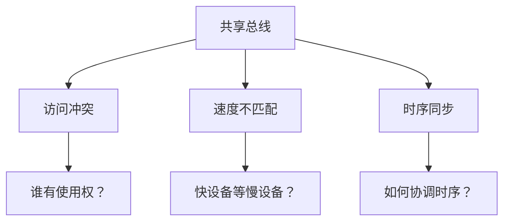

## 总线系统：计算机的"神经网络"

### 1. 为什么需要总线？— 从连接复杂性谈起

#### 1.1 计算机系统的连接挑战

想象一下，如果你要组织一个 10 人的团队会议，让每个人都能与其他人直接对话，你需要多少条"通信线路"？

**全连接方式的数学困境：**

- 2 个设备：1 条连线
- 3 个设备：3 条连线
- 4 个设备：6 条连线
- n 个设备：**n(n-1)/2** 条连线

这意味着一个包含 CPU、内存、显卡、硬盘、网卡等 10 个主要组件的计算机，如果采用全连接方式，需要 **45 条专用连线**！

#### 1.2 现实世界的类比

这就像城市交通系统的设计选择：

| 连接方式   | 城市交通类比           | 计算机系统          |
| ---------- | ---------------------- | ------------------- |
| **全连接** | 每个地点间都有专用道路 | 每对设备间都有专线  |
| **总线**   | 主干道路 + 支路系统    | 共享总线 + 设备接口 |

**总线的诞生动机：**

- ✅ **简化连接**：n 个设备只需 n 条连线到总线
- ✅ **降低成本**：减少物理线路和接口数量
- ✅ **易于扩展**：新设备只需连接到总线即可
- ✅ **标准化**：统一的通信协议和接口

#### 1.3 总线带来的新挑战

但是，共享带来了新的问题，就像公共道路一样：



**核心问题：**

1. **仲裁问题**：多个设备同时要使用总线怎么办？
2. **寻址问题**：如何确保数据到达正确的目标？
3. **时序问题**：不同频率的设备怎么通信？

这些问题的解决方案构成了总线系统设计的核心内容。

### 2. 总线系统的演进历程

#### 2.1 从简单到复杂：总线结构的演化

##### 单总线时代：简单但受限

```
[CPU] ──┐
         │
[主存] ──┼─── 系统总线 (50-100MHz)
         │
[I/O接口] ──┘
```

**历史背景：** 早期计算机（1960-1980年代）追求简单性和成本控制。

**现实问题：**

- 🐌 **性能瓶颈**：所有设备争抢同一条"高速公路"
- 📈 **扩展受限**：添加设备会进一步降低性能
- ⚡ **频率限制**：受最慢设备制约

##### 双总线时代：分离关注点

```
[CPU] ──── 主存总线 (200MHz) ──── [主存]
  │
  └──── [通道] ──── I/O总线 (66MHz) ──── [I/O设备群]
```

**设计思路：** 将高速存储访问与相对较慢的I/O操作分离。

**改进效果：**

- ✅ **并发性提升**：CPU可以同时访问内存和I/O
- ✅ **专门优化**：不同总线可针对特定需求优化
- ❌ **复杂性增加**：需要更多的控制逻辑

##### 现代多总线时代：层次化设计

```
CPU ─── L1/L2缓存总线 (3GHz)
 │
 ├──── 内存总线 (1600MHz) ─── DDR4内存
 │
 ├──── PCIe总线 (16GT/s) ─── 显卡/高速设备
 │
 └──── 南桥 ─── USB/SATA/网络接口
```

**设计原理：** 按设备速度和重要性分层，形成总线层次结构。

#### 2.2 传输方式的技术选择

##### 为什么从并行转向串行？

**并行总线的物理限制：**

```
数据线0: ─────/─\─────  (信号完整)
数据线1: ──────/─\────  (略有延迟)
数据线2: ───────/─\───  (更多延迟)
...
时钟线:   ─┐ ┌─┐ ┌─┐ ┌─  (基准时钟)
```

**高频下的问题：**

- ⚡ **时序偏移**：不同线路的信号到达时间不同
- 📡 **串扰干扰**：相邻线路间的电磁干扰
- 💰 **成本增加**：需要更多物理线路

**串行总线的优势：**

- 🎯 **时序简单**：只有一对差分线
- 🛡️ **抗干扰强**：差分信号抵消噪声
- 💡 **可扩展**：可以通过提升频率增加带宽

### 3. 总线仲裁：解决"交通管制"问题

#### 3.1 为什么需要仲裁？

仲裁决定哪个设备占用总线。

考虑这个现实场景：

```
CPU想读取内存数据    ←─── 总线 ───→    硬盘想写入数据
网卡想传输数据包     ←─── 总线 ───→    显卡想更新显存
```

**冲突的后果：**

- 📊 数据损坏
- 🔄 系统混乱
- 💥 可能崩溃

#### 3.2 仲裁策略的演进

##### 集中式仲裁：有序但可能低效

**链式查询方式：**

```
仲裁器 ─→ 设备A ─→ 设备B ─→ 设备C ─→ 设备D
         (高优先级)              (低优先级)
```

**优点：** 实现简单，成本低
**缺点：** 距离仲裁器远的设备可能"饿死"

**独立请求方式：**

```
       ┌─ 请求A ──┐
设备A ─┤          ├─ 仲裁器
       └─ 授权A ──┘
       ┌─ 请求B ──┐
设备B ─┤          ├─ 仲裁器
       └─ 授权B ──┘
```

**优点：** 响应快，优先级灵活
**缺点：** 需要更多控制线

##### 分布式仲裁：自主但复杂

**设计动机：** 避免仲裁器成为单点故障，提高系统可靠性。

**冲突检测机制：**

1. 设备同时发送仲裁信号
2. 通过优先级编码决定获胜者
3. 失败设备自动退出竞争

### 4. 异步通信：解决"速度不匹配"问题

#### 4.1 问题的现实性

现代计算机中的设备速度差异巨大：

| 设备类型 | 典型频率 | 数据处理能力        |
| -------- | -------- | ------------------- |
| **CPU**  | 3.5GHz   | 每纳秒处理3.5条指令 |
| **内存** | 1.6GHz   | 每纳秒1.6次访问     |
| **SSD**  | -        | 每微秒100-500次读写 |
| **HDD**  | -        | 每毫秒0.1-0.2次访问 |

**速度差异：** CPU比硬盘快 **10,000,000倍**！

#### 4.2 同步vs异步的选择

##### 同步总线：简单但受限

```
时钟: ┌─┐ ┌─┐ ┌─┐ ┌─┐
     │ │ │ │ │ │ │ │
设备A: ───┬───┬───┬───  (跟上节拍)
设备B: ───────────┬───  (慢，拖累全局)
```

**问题：** 所有设备必须同步到最慢设备的速度。

##### 异步总线：复杂但灵活

**握手协议的设计思路：**

```
高速设备                     低速设备
    │                         │
    ├─ 1. 发送数据请求 ─────→ │
    │                         ├─ 2. 处理中...
    │                         ├─ 3. 发送确认信号
    ←─ 4. 收到确认，继续 ────┤
```

**核心优势：**

- 🔄 **自适应**：每个设备按自己的节奏工作
- ⚡ **无等待**：快设备不被慢设备拖累
- 🎯 **可靠性**：确认机制保证数据完整性

#### 4.3 高频写低频的实际解决方案

##### 缓冲机制：时间解耦

```
高频CPU ─→ [高速缓冲区] ─→ 低频硬盘
(3.5GHz)    (FIFO队列)     (100Hz)
```

**设计原理：**

1. **写操作**：CPU快速写入缓冲区即返回
2. **读操作**：硬盘按自己的节奏从缓冲区读取
3. **流控**：缓冲区满时CPU暂停写入

##### 中断机制：事件驱动

```
低速设备: "我准备好了！" ─→ [中断控制器] ─→ CPU
CPU: 暂停当前工作 ─→ 处理数据传输 ─→ 恢复工作
```

**优势：** 避免CPU无效轮询，提高系统效率。
