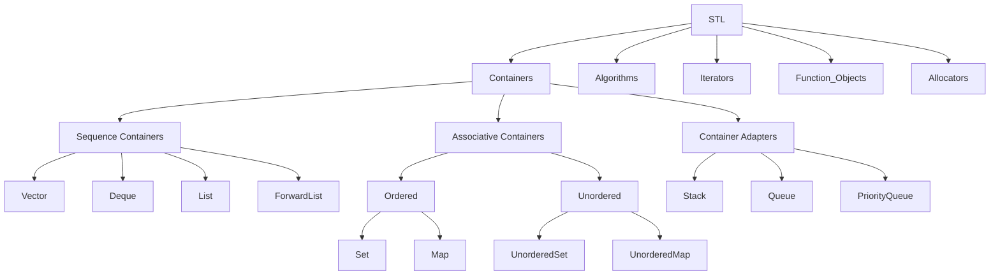

# C++ STL 知识体系深度解析

## 一、容器特性与使用规范

### 1. 实时性约束容器选型
- **unordered_map 的限制**  
  在实时性要求极高的场景（如高频交易系统、实时控制系统）中应避免使用 `unordered_map`。其哈希表实现的最坏时间复杂度为 O(n)，可能导致不可预测的延迟。


### 2. 键值容器的插入行为
#### 插入不覆盖原则
```cpp
std::map<std::string, int> table;
table.insert({"小彭老师", 24});
table.insert({"小彭老师", 42});  // 插入失败，值仍为24
```
- **原理**：`insert()` 方法检测到键已存在时，保留原值并返回插入失败的迭代器。

#### 覆盖插入方案对比
| 方法                | 特性                                                                 |
|---------------------|----------------------------------------------------------------------|
| `operator[]`        | 若键不存在则插入默认值，存在时直接覆盖值                             |
| `insert_or_assign`  | (C++17+) 显式语义，无论键是否存在都会执行插入或覆盖，避免隐式构造损耗 |

```cpp
// C++17 推荐方式
table.insert_or_assign("小彭老师", 24);  // 插入
table.insert_or_assign("小彭老师", 42);  // 覆盖
```

---

### 3. 容器元素高效删除
#### Vector 删除优化
- **Back-Swap-Erase 模式**  
  利用 `swap` 将待删元素移至末尾后 `pop_back`，避免中间删除导致的大量元素移动。
  ```cpp
  auto it = vec.begin() + target_idx;
  std::swap(*it, vec.back());
  vec.pop_back();
  ```

- **逻辑删除 + 物理压缩**  
  配合 `erase-remove` 惯用法与 `lower_bound` 实现高效区间删除：
  ```cpp
  vec.erase(std::remove_if(vec.begin(), vec.end(), pred), vec.end());
  ```

- **`lower_bound` 方法**
  当 `vector` 是有序的，并且需要删除某个值的所有元素时，可以使用 `lower_bound` 方法。`lower_bound` 会返回一个迭代器，指向第一个不小于给定值的元素。结合 `erase` 函数可以删除指定值的所有元素。

  ```cpp
  #include <vector>
  #include <algorithm>

  void removeAllElements(std::vector<int>& vec, int value) {
      auto it = std::lower_bound(vec.begin(), vec.end(), value);
      while (it != vec.end() && *it == value) {
          it = vec.erase(it);
      }
  }
  ```

## 二、STL 核心组件详解

STL，全称Standard Template Library（标准模板库），是C++标准库的一部分。它包含了一系列的模板类和函数，主要用于数据处理和算法操作。STL的主要内容包括：

1. **容器（Containers）**：如vector、list、deque、set、map等，用于存储和操作数据。

2. **算法（Algorithms）**：如sort、find、copy、for_each等，提供了一系列对容器进行操作的通用算法。

3. **迭代器（Iterators）**：提供了一种方法，可以按照一定的顺序访问容器中的元素，而无需暴露容器的内部表示。

4. **函数对象（Functors）**：这是一种特殊的对象，可以像函数一样被调用。函数对象通常用于创建可定制的算法。

5. **适配器（Adapters）**：如stack、queue、priority_queue等，它们是在其他容器的基础上，提供了不同的接口。

6. **分配器（Allocators）**：用于控制STL容器的内存分配。

### 1. 容器分类与特性对比

#### 序列容器
| 容器          | 数据结构     | 访问复杂度 | 插入/删除复杂度      | 核心特性                             |
|---------------|--------------|------------|----------------------|--------------------------------------|
| `vector`      | 动态数组     | O(1)       | 尾部 O(1)，其他 O(n) | 内存连续，随机访问快                 |
| `deque`       | 分块双向队列 | O(1)       | 头尾 O(1)，其他 O(n) | 多块内存非连续，支持高效双端扩展     |
| `list`        | 双向链表     | O(n)       | O(1)                 | 任意位置插入删除快，无缓存局部性     |
| `forward_list`| 单向链表     | O(n)       | O(1)                 | 最小化内存开销，仅支持前向遍历       |

#### 关联容器
| 容器               | 数据结构 | 有序性 | 键唯一性 | 操作复杂度  |
|--------------------|----------|--------|----------|-------------|
| `set/multiset`     | 红黑树   | 是     | 是/否    | O(log n)    |
| `map/multimap`     | 红黑树   | 是     | 是/否    | O(log n)    |
| `unordered_*`      | 哈希表   | 否     | 是/否    | 平均 O(1)   |

#### 容器适配器
| 适配器            | 底层容器   | 操作限制              | 典型应用场景         |
|-------------------|------------|-----------------------|----------------------|
| `stack`           | deque/list | LIFO（仅顶端操作）    | 函数调用栈、撤销操作 |
| `queue`           | deque/list | FIFO（两端操作）      | 任务队列、BFS算法    |
| `priority_queue`  | vector     | 按优先级出队（堆结构）| 调度系统、Dijkstra算法 |

---

### 2. 内存管理关键机制

#### Vector 动态扩容
- **扩容策略**：倍增式增长（2^n），保证均摊 O(1) 的插入时间复杂度
- **内存操作对比**：
  ```cpp
  vector<int> v;
  v.reserve(100);    // 预分配空间（capacity=100，size=0）
  v.resize(50);      // 创建50个默认初始化的元素（size=50）
  v.shrink_to_fit(); // 请求释放未使用内存（非强制）
  ```

#### Deque 分块存储
- **内存布局**：由多个固定大小的内存块组成双向队列
- **优势**：头尾插入不引发全局数据迁移，适合频繁双端操作场景

---

## 三、关键算法与编程技巧

### 1. 容器操作进阶技巧

#### 安全遍历与删除
- **Map 隔元素删除**  
  利用后置递增避免迭代器失效：
  ```cpp
  for(auto it = m.begin(); it != m.end(); ) {
    auto current = it++;
    if (condition) m.erase(current);
  }
  ```

#### 类型安全增强
- **多态值容器**  
  使用 `std::any` 实现异构容器：
  ```cpp
  std::map<std::string, std::any> poly_map;
  poly_map["value"] = 42;          // 存储int
  poly_map["name"] = "Alice";      // 存储string
  ```

---

### 2. 算法库高效使用

#### 空间预分配范式
```cpp
std::vector<int> input{1,2,3};
std::vector<int> output;
output.reserve(input.size());  // 必须预分配
std::transform(input.begin(), input.end(), 
              std::back_inserter(output), [](int x){ return x*x; });
```

#### 排序优化策略
- **对象排序**：对 `list` 使用成员函数 `sort()` 比全局 `std::sort` 更高效
- **谓词选择**：利用 `std::greater<>` 实现降序排列
  ```cpp
  std::sort(vec.begin(), vec.end(), std::greater<int>());
  ```

---

## 四、底层实现与工程实践

### 1. 核心组件实现原理

#### Vector 动态数组
- **扩容流程**：
  1. 分配新内存（通常为原容量2倍）
  2. 拷贝/移动原元素
  3. 销毁旧内存
- **关键优化**：C++11 引入移动语义减少拷贝开销

#### String 实现机制
- **SSO 优化**：短字符串（通常<=15字符）直接存储在对象内部，避免堆分配
- **内存策略**：采用指数扩容（类似vector），维护 `size`、`capacity` 和字符缓冲区

---

### 2. 线程安全指南

#### 容器线程安全层级
| 安全级别        | 典型容器                | 同步要求                     |
|-----------------|-------------------------|------------------------------|
| 完全非安全      | vector, map, unordered_*| 需外部锁（如 mutex）         |
| 读操作安全      | const 方法              | 写操作仍需同步               |
| 并发容器        | TBB/concurrent_queue    | 内部锁机制，原子操作保证安全 |

#### 同步最佳实践
```cpp
std::mutex mtx;
std::vector<int> shared_vec;

void safe_push(int val) {
    std::lock_guard<std::mutex> lock(mtx);
    shared_vec.push_back(val);
}
```

---

## 五、经典面试问题剖析

### 1. 内存操作函数实现
#### 安全版 strcpy
```cpp
char* safe_strcpy(char* dst, const char* src) {
    if (dst == nullptr || src == nullptr) return nullptr;
    if (dst == src) return dst;
    
    size_t len = strlen(src) + 1;
    if (dst < src + len && dst > src) {  // 处理重叠
        memmove(dst, src, len);
    } else {
        memcpy(dst, src, len);
    }
    return dst;
}
```

### 2. 动态数组设计要点
1. **三指针管理**：使用 `start`, `finish`, `end_of_storage` 分别表示内存起始、元素末尾和容量末尾
2. **类型萃取**：通过 `std::is_trivially_copyable` 优化拷贝操作
3. **异常安全**：强异常保证的插入操作实现

---

## 附：STL 组件关系图


### 3. quiz

#### 为什么stl中的内存分配器要设计为一个模板参数而不是一个构造函数参数?

#### vector问题
    尽量不要在vector中存放bool类型,vector为了做优化,它的内部存放的其实不是bool.

#### 实现一个动态数组要怎么实现,说思路(腾讯teg一面)
模拟STL中vector的实现即可,去看一下vector的源码.

#### 隔一个删除一个map中的元素(主要考察迭代器的失效问题)

#### STL库，vector的内存管理，deque的内存管理，list的排序
vector的内存管理原理是动态数组。当我们创建一个vector对象时,它会分配一块连续的内存来存储元素。当我们向vector中添加元素时,如果当前内存空间不足以容纳新的元素,vector会自动重新分配更大的内存块,并将原有的元素复制到新的内存块中。这个过程称为动态内存分配。当我们从vector中删除元素时,vector会释放不再使用的内存,以便节省内存空间。

deque的内存管理原理是双端队列。deque是由多个连续的内存块组成的,每个内存块都存储一定数量的元素。当我们向deque中添加或删除元素时,deque会根据需要在内存块的前端或后端进行插入或删除操作。这种设计使得deque在插入和删除元素时具有较好的性能,因为它不需要像vector那样重新分配内存和复制元素。

list的排序是通过链表的操作实现的。链表是由一系列节点组成的数据结构,每个节点都包含一个元素和指向下一个节点的指针。当我们对list进行排序时,list会使用一种称为"归并排序"的算法。归并排序将链表分割成较小的子链表,然后逐步合并这些子链表,直到得到一个有序的链表。归并排序的时间复杂度为O(nlogn),在大多数情况下比其他排序算法更高效。

#### map<K, V> 或 vector<V> 的值类型只能是固定的 V，如何支持任意类型？（使用 std::any 代替固定的 V）


#### STL 空间配置器如何处理内存的？